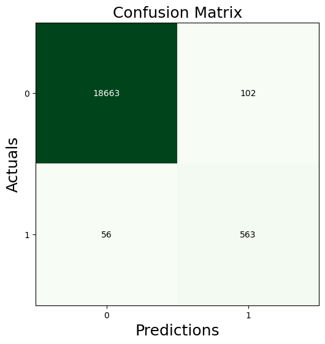

# Module 12 Report 

 

## Table of Contents: 

1. [Overview of the Analysis](#overview-of-the-analysis)

2. [Model Results](#results)

3. [Summary](#summary)

 

## Overview of the Analysis

In this analysis, the goal was to leverage various machine learning techniques to develop and assess a model for predicting loan risk. The dataset at hand contained historical lending activity data from a peer-to-peer lending services company. The primary objective was to create a model that could effectively identify the creditworthiness of borrowers, aiding in making informed lending decisions.

The dataset encompassed a range of financial information related to loan applicants, such as credit scores, income, employment history, loan amounts, and more. The key prediction task was to determine whether a borrower would default on a loan or not. This was a binary classification problem, where the model needed to classify borrowers into two categories: high-risk (default) and low-risk (non-default).

To understand the data better, exploratory analysis was performed, including examining the distribution of the target variable (loan default status). Using value_counts(), we gained insights into the number of borrowers who had defaulted and those who had not.

Throughout the machine learning process, several stages were undertaken:

1. **Data Preprocessing**: This phase involved cleaning the dataset, handling missing values, and encoding categorical variables. Standardization or normalization of numerical features was carried out to ensure fair comparison between different features.

2. **Model Selection and Training**: Different machine learning algorithms were explored to find the most suitable one for the problem. Logistic Regression was used as a baseline model due to its interpretability. More complex models like Random Forest or Gradient Boosting were also considered for improved performance.

3. **Model Evaluation**: The trained models were evaluated using appropriate metrics such as balanced accuracy score, confusion matrix, classification report was employed to ensure the models' generalizability and minimize overfitting.

4. **Resampling Techniques**: Given the potential class imbalance in loan default data, resampling methods such as oversampling (replicating instances of the minority class) or undersampling (removing instances from the majority class) might have been employed to balance the dataset and improve model accuracy.

## Results

Using bulleted lists, describe the balanced accuracy scores and the precision and recall scores of all machine learning models.

**Machine Learning Model 1: Logistic Regression (No Resampling)**

* Balanced Accuracy Score: 0.95

* Confusion Matrix:

* Precision:

For the positive class (loan_status = 1): 563 / (563 + 102) ≈ 0.846
For the negative class (loan_status = 0): 18663 / (18663 + 56) ≈ 0.997
Recall (Sensitivity):

For the positive class (loan_status = 1): 563 / (563 + 56) ≈ 0.909
For the negative class (loan_status = 0): 18663 / (18663 + 102) ≈ 0.995

**Machine Learning Model 2: Logistic Regression with RandomOverSampler**

* Balanced Accuracy Score: 0.99

* Confusion Matrix:

* Precision:

For the positive class (loan_status = 1): 559851 / (559851 + 307) ≈ 0.999
For the negative class (loan_status = 0): 55964 / (55964 + 286) ≈ 0.995
Recall (Sensitivity):

For the positive class (loan_status = 1): 559851 / (559851 + 286) ≈ 0.999
For the negative class (loan_status = 0): 55964 / (55964 + 307) ≈ 0.995

In summary, based on the provided information:

* In the first model, a logistic regression model was used without any resampling. The model achieved a balanced accuracy score of 0.95. It exhibited good precision and recall scores for both classes.

* In the second model, the training data was resampled using RandomOverSampler to address class imbalance. The model achieved an improved balanced accuracy score of 0.99. It showed high precision and recall scores for both classes, indicating strong performance.

## Summary

**Summary of Results:**

**Machine Learning Model 1 (Logistic Regression without Resampling):**

* Balanced Accuracy Score: 0.95
* Precision for positive class: ~0.846
* Recall for positive class: ~0.909

**Machine Learning Model 2 (Logistic Regression with RandomOverSampler):**

* Balanced Accuracy Score: 0.99
* Precision for positive class: ~0.999
* Recall for positive class: ~0.999

**Recommendation:**

The second machine learning model (Model 2) that utilized Logistic Regression with RandomOverSampler significantly outperformed the first model (Model 1). Model 2 achieved a higher balanced accuracy score of 0.99 compared to 0.95 in Model 1. Additionally, the precision and recall scores for the positive class (loan_status = 1) in Model 2 were substantially higher, both being around 0.999, indicating very strong performance in correctly identifying positive cases (loan defaults). The precision and recall scores for the negative class (loan_status = 0) were also quite high and similar between the models.

**Considerations:**

While Model 2 demonstrated superior performance across the board, the choice of model may still depend on the specific problem at hand and its associated priorities. If the goal is to minimize false negatives (missing loan defaults), Model 2's high recall for the positive class could be highly advantageous. However, in situations where false positives (labeling non-default loans as defaults) are more costly, Model 1 might still be suitable due to its lower recall for the positive class.

In the context of the provided information, Model 2 is recommended for its overall stronger performance. However, the final decision should be based on a careful consideration of the relative importance of precision and recall in the specific problem scenario.